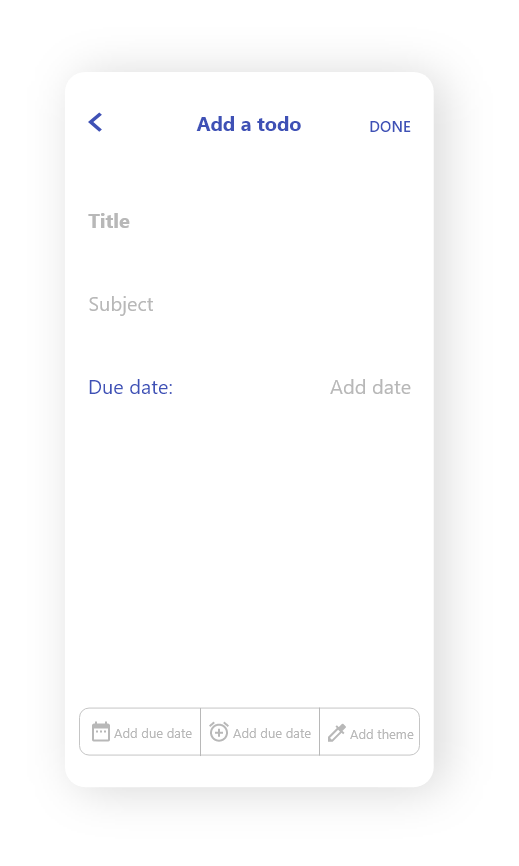

# Two-Dos
This application is a simple to-do application which is fully responsive to any device model and ready to be published. The application is completely built on Flutter framework but since the inavailability of mac-book, the application is not configured for iOS platform.
<br><br>

## 📅 Database
The backend of this apllication is built on Hive databse. Hive is a lightweight, noSQL database.

## 📱 Screenshots
&ensp;&ensp;
&ensp;&ensp;
&ensp;&ensp;

## 💻 Test application on your machine
Open CMD from where you want to clone the project & run the following commands:
```
  git clone https://github.com/x-abgth/two-dos.git
```
```
  cd two-dos
 ```
 ```
  flutter packages get
 ```
 ```
  flutter run
```
## ❤ Conclusion
🌟 Star this repo & follow for more 😊
